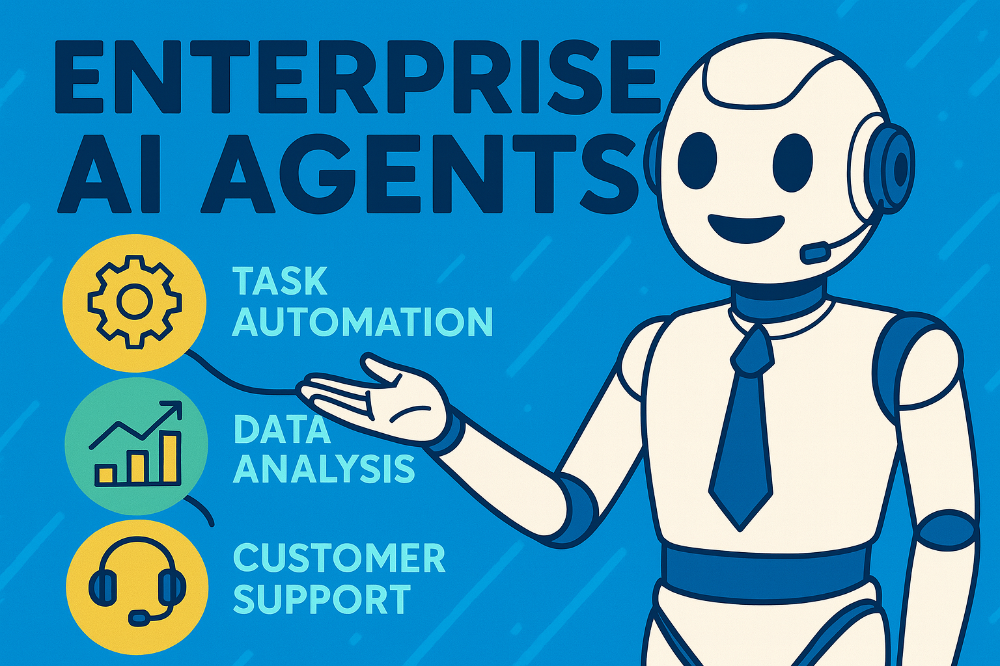

<!-- Banner -->
<p align="center">
  
</p>

<h1 align="center">⚡ ENTERPRISE SUPER AGENT ⚡</h1>

<p align="center">
  <b>The next-gen AI system for automation, intelligence & business workflow mastery.</b>  
</p>

<p align="center">
  
  
  
</p>

---

## 🎯 Why Enterprise Super Agent?

> **Because your business deserves speed, automation, and intelligence — all in one AI powerhouse.**

This agent is crafted to act like a  
**Business Analyst + Automation Engine + Research Assistant + Data Expert**  
combined into one modular AI system.

---

## 🚀 Core Capabilities (Next-Level)

### 🧠 1. Smart Reasoning Engine  
- Multi-step planning  
- Tool chaining  
- Auto error recovery  
- Context-aware decisions  

### 💼 2. Enterprise Automation  
- Report generation  
- Office workflow execution  
- Smart email writing  
- Meeting minutes + agendas  

### 🔍 3. Web Intelligence  
- Market analysis  
- Live research  
- News extraction  
- Company data insights  

### 📊 4. Data Interpretation  
- Reads CSV / JSON / PDF  
- Generates insights  
- Performs calculations  
- Runs Python for analysis  

### ⚙️ 5. Tool Ecosystem  
Includes:  
✔ Web Search  
✔ Code Execution  
✔ File Processing  
✔ Data Reader  
✔ Custom enterprise tools  

---
## 📦 Installation

```bash
git clone https://github.com/CodeWithShivanshu/ENTERPRISE-AI-AGENT.git
cd agents
```
## Run
```run
adk web 
```

## ⚙️ Enterprise AI Agent Architecture (Simplified)
```architecture
--------------------------------------------
|           USER INTERFACE (UI)            |
|   Chat, Dashboard, API Endpoint   |
--------------------------------------------
                 |
                 v
--------------------------------------------
|        CONTEXT + MEMORY LAYER            |
| Session memory, user profile, embeddings |
--------------------------------------------
                 |
                 v
--------------------------------------------
|        INTENT ROUTER (Brain)             |
| workflow / analytics / support / general |
--------------------------------------------
          /         |         \
         v          v          v
--------------------------------------------
|   WORKFLOW     ANALYTICS     SUPPORT     |
|    ENGINE        ENGINE        ENGINE    |
--------------------------------------------
      |             |            |
      v             v            v
--------------------------------------------
|         TOOLS / ACTION MODULE           |
|  google_search, email, APIs, tasks  |
--------------------------------------------

```

